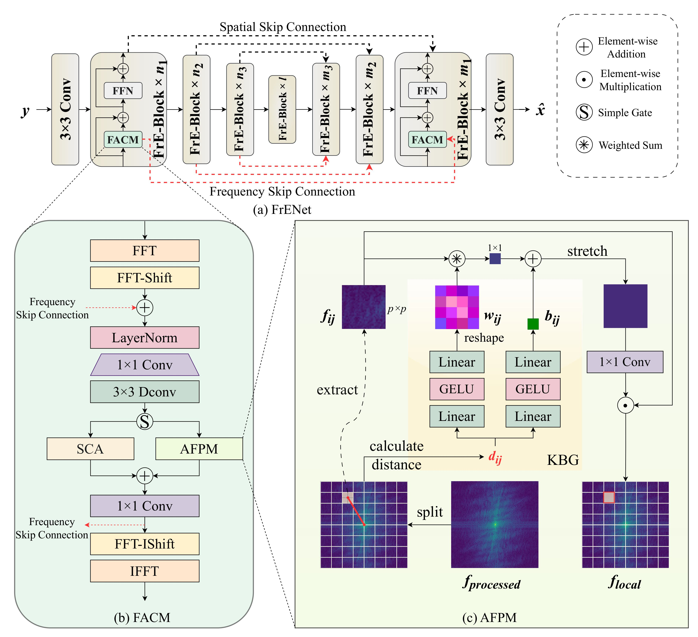
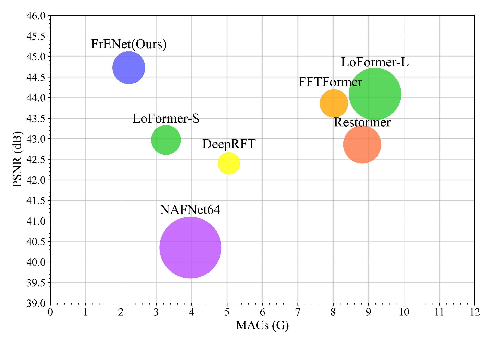

# Efficient RAW Image Deblurring with Adaptive Frequency Modulation
Wenlong Jiao, Binglong Li, Wei Shang, Ping Wang, [Dongwei Ren](https://csdwren.github.io/)
<div style="display: flex; justify-content: center; align-items: center;">
  <a href="http://arxiv.org/abs/2505.24407" style="margin: 0 2px;">
    
  </a>
</div>

***
>**Abstract**: Image deblurring plays a crucial role in enhancing visual clarity across various applications. Although most deep learning approaches primarily focus on sRGB images, which inherently lose critical information during the image signal processing pipeline, RAW images, being unprocessed and linear, possess superior restoration potential but remain underexplored.  Deblurring RAW images presents unique challenges, particularly in handling frequency-dependent blur while maintaining computational efficiency. To address these issues, we propose Frequency Enhanced Network (FrENet), a framework specifically designed for RAW-to-RAW deblurring that operates directly in the frequency domain. We introduce a novel Adaptive Frequency Positional Modulation module, which dynamically adjusts frequency components according to their spectral positions, thereby enabling precise control over the deblurring process. Additionally, frequency domain skip connections are adopted to further preserve high-frequency details. Experimental results demonstrate that FrENet surpasses state-of-the-art deblurring methods in RAW image deblurring, achieving significantly better restoration quality while maintaining high efficiency in terms of reduced MACs. Furthermore, FrENet's adaptability enables it to be extended to sRGB images, where it delivers comparable or superior performance compared to methods specifically designed for sRGB data. The source code will be publicly available.
***

## Network Architecture


## QuickRun

### Install

```bash
conda create -n your_env python=3.9
conda activate your_env
pip install -r requirements.txt
```

### Training

1. Download **[Deblur-RAW](https://github.com/bob831009/raw_image_deblurring)** training and testing data.
2. Please change the dataset path in `options/frenet.yml` to the path of your dataset and run

```bash
torchrun --nproc_per_node=2 train.py -config options/frenet.yml 
```

### Evaluation

Please download the pre-trained deblurring model to the `checkpoints` folder and run

```bash
python eval_raw.py -config options/frenet.yml
```

### Generating DNG with Original Metadata

To ensure the deblurred RAW output can be correctly processed by standard RAW editors, it's crucial to embed the original camera's metadata into the final DNG file. We provide scripts to facilitate this process. The method involves first extracting metadata from the blurry RAW file and then injecting it into the deblurred output.

This process requires ExifTool. Please install it first.

Use `metadata.py` to extract the metadata from the original blurry RAW image. And then use `add_exif.py` to process the blurry RAW image through the model and inject the extracted metadata into the deblurred result.

## Results



FreNet achieved state-of-the-art (SOTA) performance in RAW image deblurring.


## Citation

```
@misc{jiao2025efficient,
    title={Efficient RAW Image Deblurring with Adaptive Frequency Modulation},
    author={Wenlong Jiao and Binglong Li and Wei Shang and Ping Wang and Dongwei Ren},
    year={2025},
    eprint={2505.24407},
    archivePrefix={arXiv},
    primaryClass={eess.IV}
}
```

## Contact

If you have any question, please contact [wenlong@tju.edu.cn](wenlong@tju.edu.cn) or [li_binglong@tju.edu.cn](li_binglong@tju.edu.cn)

## Acknowledgment

Some codes are based on [NAFNet](https://github.com/megvii-research/NAFNet) and  [BasicSR](https://github.com/xinntao/BasicSR) toolbox. Thanks for their awesome works.


